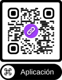

# Habituate — Guía rápida para usuarios

Bienvenido a Habituate. Esta aplicación te ayuda a crear, seguir y completar hábitos y tareas diarias para mejorar tu productividad y constancia.

Puedes probar la versión web escaneando este QR:\

Puedes descargarte el archivo APK para Android aqui:\

En pocas palabras, Habituate te permite:
- Registrar una cuenta y configurar números de contacto.
- Crear hábitos recurrentes y programar recordatorios.
- Añadir tareas puntuales y marcarlas como completadas.
- Consultar tu progreso diario y rachas en el dashboard.
- Ajustar la apariencia (tema y tamaño de letra).

---

## Primeros pasos (usuario)

1. Regístrate o inicia sesión con tu correo.
2. Si eres usuario nuevo, completa el asistente inicial para añadir tus números de contacto (número de preferencia y número de urgencia).
3. Navega entre las pestañas para crear hábitos, revisar el día y personalizar tus ajustes.

Importante: tu información y preferencias se guardan en la nube para que puedas iniciar sesión desde cualquier dispositivo.

---

## Pantallas y cómo usarlas

Las pantallas principales de la app y su uso:

- **Inicio / Dashboard (Logros)**
	- Qué muestra: un resumen rápido con gráficos de hábitos completados en los últimos días y estadísticas (hábitos activos, tareas pendientes, completadas hoy y racha actual).
	- Uso: revisa tu progreso diario; toca los elementos de navegación para ir a listas detalladas o crear entradas nuevas.

- **Hábitos del día**
	- Qué muestra: la lista de hábitos programados para hoy con su estado (completado / pendiente) y hora de recordatorio si existe.
	- Uso: marca un hábito como completado cuando lo realices; edita un hábito para cambiar su frecuencia, hora o categoría.

- **Crear hábito**
	- Qué permite: definir el nombre del hábito, descripción, categoría, color/icono, frecuencia (diario/semanal/mensual) y hora de recordatorio.
	- Uso: crea hábitos con objetivos claros; configura recordatorios para que la app te lo recuerde en el momento deseado.

- **Crear tarea**
	- Qué permite: añadir tareas puntuales con título, descripción, fecha de vencimiento y categoría.
	- Uso: gestiona acciones concretas que no son hábitos; marca tareas como completadas para mantener tu dashboard actualizado.

- **Perfil**
	- Qué muestra: tus datos de usuario (nombre, correo) y los números configurados.
	- Uso: edita tu nombre o números de teléfono en caso de cambio; estos números se usan para contactos/urgencias si aplica.

- **Ajustes**
	- Qué permite: cambiar el tamaño de letra y el tema (claro/oscuro). También muestra la versión de la app.
	- Uso: ajusta la lectura según tu preferencia y guarda los cambios; los ajustes se aplican a toda la app.

- **Emergencia**
	- Qué muestra/permite: acceso rápido a contactos o acciones de emergencia configuradas por el usuario.
	- Uso: utiliza esta pantalla para marcar o acceder rápidamente a contactos de urgencia.

- **Registro / Login / Asistente inicial**
	- Qué permite: crear cuenta, iniciar sesión y configurar datos iniciales (números de teléfono).
	- Uso: sigue los pasos del formulario; si olvidas la contraseña, usa el flujo de recuperación (según lo configure la app).

---

## Notas sobre privacidad y datos

- Los datos (hábitos, tareas y preferencias) se almacenan en la nube para que puedas recuperar tu cuenta desde distintos dispositivos.
- Los números de teléfono que registres se usan para funciones de contacto/urgencia; no se comparten públicamente.
- Si tienes dudas sobre privacidad, contacta con el responsable del servicio o revisa la política de privacidad provista por el equipo.

---

## Consejos de uso

- Establece recordatorios para hábitos críticos para aumentar la probabilidad de cumplimento.
- Revisa tu dashboard al final del día para llevar un seguimiento y consolidar una racha.
- Usa categorías y colores para organizar mejor tus hábitos y tareas.
